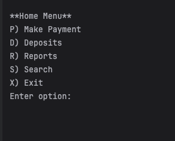
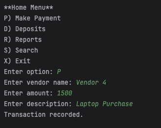
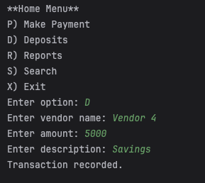
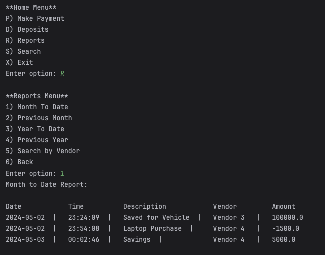
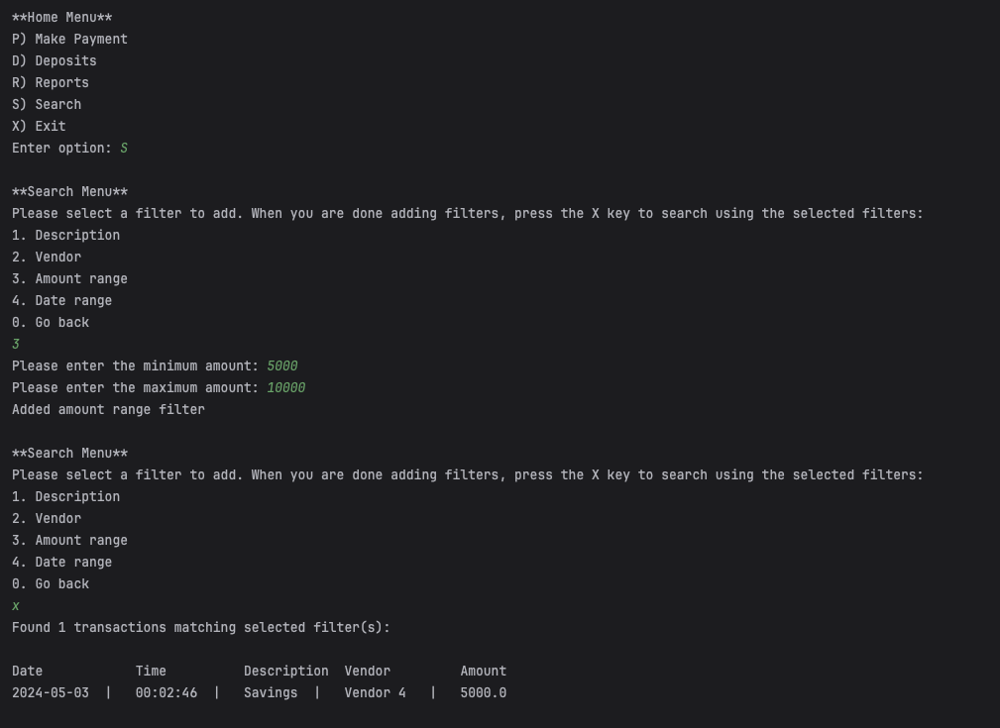
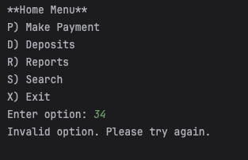
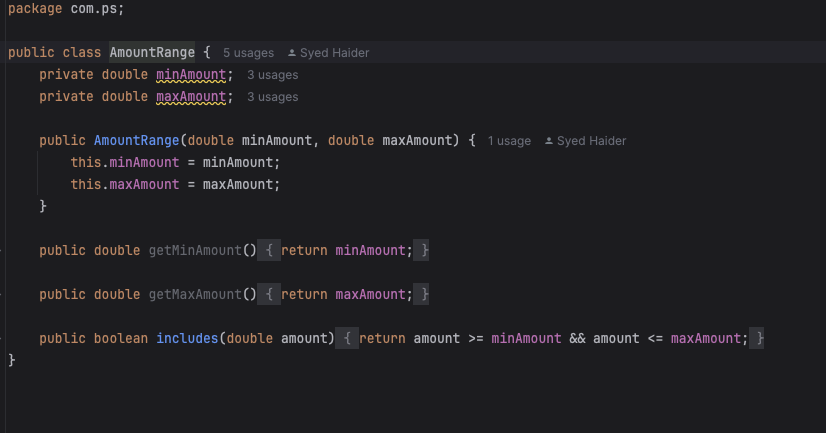
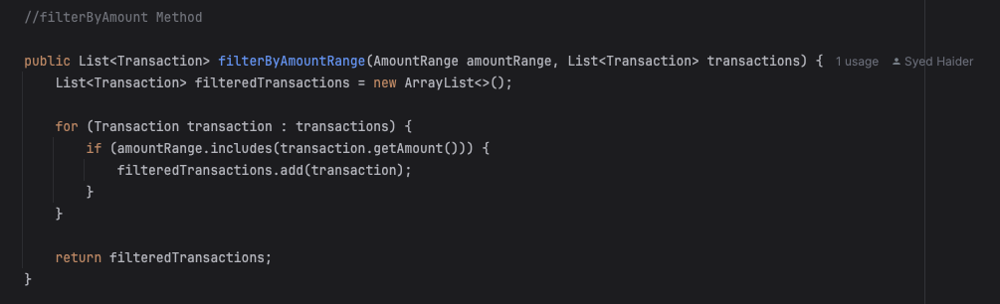

# Accounting Ledger

This program allows user to track their transactions by means of ledger.

## Purpose
This application is crafted to streamline the management of financial transactions. It enables users to record, search, and generate detailed reports about their financial activities efficiently.

## Motivation and Target Audience
The Financial Transaction Manager is designed for individuals and small businesses that require a straightforward method to track their financial transactions without the need for complex accounting software.

# #Key Components
TransactionManager
Responsible for all operations related to transactions, including loading, saving, and querying transaction data.

## Menu
Offers a console-based user interface that facilitates user interaction with the system.

## OutputFormatter
Ensures transaction data is formatted into a clear and readable format.

## Application Flow
The program commences with the Main class, which initializes the TransactionManager and displays the main menu to engage users. This design provides a smooth and intuitive user experience.

## Application Home Screen

This is the Home Screen.

**
 Make Payment 
**

When the user decides to make a payment they are prompted to enter the details of the payment they are making and the payment is recorded.

 

**
 Deposit 
**

When the user decides to make a deposit they are prompted to enter the details of the deposit they are making and the deposit is recorded.

**
 Reports 
**

The user can perform various types of reporting including Month to date.

**
 Search 
**

The user can search for transaction using various filters including amount range. User could also add multiple filters.

## Error Handling

Anytime the user enters an invalid command, an "invalid command" message will show up, and the user will have to try again and enter a valid command.

## Interesting Piece of Code

The interesting piece of code was filter by amount range.

 

1. Encapsulation with AmountRange:
The AmountRange class encapsulates numerical boundaries, providing methods to check if amounts fall within a specified range. This enhances code modularity and reusability.

2. Practical Use in filterByAmountRange:
   This method leverages AmountRange to filter transactions based on amount criteria, demonstrating the class's utility in financial data processing.

